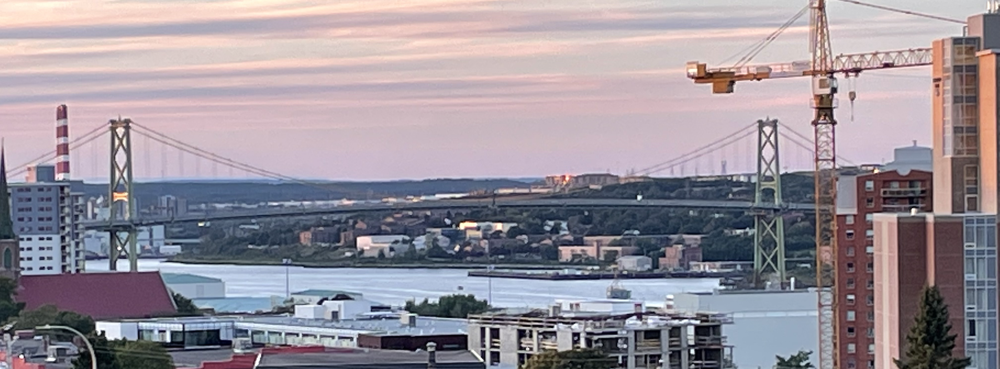

# Moving to Halifax guide

Are you moving to Halifax, NS, Canada? Notes in this article might help you get going smoother. I assume that you are coming from outside of Canada. If you are moving domestically, some of the things might not apply to you; hence, feel free to skip them.

## Landing in Canada
When you first land in any of the international airports in Canada, you will be directed to cross immigration. Typically, you plan your travel to Canada when your work/study permit or permanent residency (PR) application is approved. At the border, you will be asked to produce the permit or PR approval and you will get an actual work/study permit or PR. The whole process may take 2-3 hours, especially when the queue is long (sometimes 2-3 international flights come at the same time). Plan for it and do not book your connecting domestic flight, if any, with only 1-2 hours of gap.

## Local address
If you have booked your apartment before landing in Canada, you have an address to provide in all your forms. But if you don't have a permanent place to live when you arrive, avoid providing your hotel/Airbnb address as your address in various (official) forms. You will have trouble getting the mails from your hotel once you move to your apartment since the mails (for example, from your new bank) will arrive at your initial accommodation. You may consider providing the address of your trustworthy friend/relative/colleague alternatively.

## SIN
SIN (Social Insurance Number) is one of the most important things to do once you arrive in Canada. It will be required for you to get paid. Book an appointment in advance with Service Canada to visit personally to get it the same day. You can go to the nearest `Service Canada` without an appointment also but be ready to spend a couple of hours. You may apply online also, but it could take 1-2 weeks for it to come. Find more information about SIN application [online](https://www.canada.ca/en/employment-social-development/services/sin/apply.html).

## Phone number
Obviously, you will need a mobile number from a Canadian provider. You may choose one of the big three companies - Bell, Rogers, and Telus. You may also consider the cheaper alternatives such as Public, Fido, and Koodo, especially for pre-paid accounts.
Beware, phone connections are quite expensive in Canada. At the time of writing this article, a postpaid connection plan starts from C$80 per month. Figure out any deals available associated with your workplace/university. If you are a Dalhousie employee or student, you can get better deals with Bell; call them to know more. Remember to enquire about miscellaneous charges  and always ask if the SIM card that you are going to buy is compatible with other service providers, in the event where you want to change your service provider in the future.

## Bank account
Time for goodies. Banks in Canada target newcomers and extend attractive offers. These offers may include cash, a monthly fee waiver for a year, and free safety deposit box. Check out the details from websites of major banks (Scotia, TD, CIBC, and BMO) and choose one that fits your needs.
One interesting (and good) aspect of banking in Canada is that you are eligible to get a credit card (or loan) even if you don't have a credit history (but have a job). In the US, major banks do not offer credit cards unless you have a decent credit score and you don't have a credit score for at least 5-6 months.
It is recommended that you book an appointment with a bank of your choice prior to landing, so you can have your bank account set up as soon as you get here.

## Housing
Honestly, finding a rental apartment is challenging in Halifax. Currently, Nova Scotia is going through a housing crisis. Rental apartments are expensive and scant. They appear in the market and disappear within a couple of days, if not hours. Rental apartments near/in downtown are expensive and small. If you are willing to live within the radius of 4-5 KMs of Halifax downtown, you may get good localities with relatively more supply of apartments (for example, near Bayers Park).
As for places to find rentals, you can try looking at Kijiji or Facebook marketplace (this is useful for a variety of things, including furniture; you may get some very good deals if you keep an eye out). There are some dedicated Facebook groups (such as [Indians in Halifax](https://www.facebook.com/groups/indiansinhalifax)) also to facilitate the search.

## Public transport
Halifax has public buses (but not metro/train). Within and around Halifax downtown, buses cover the area well with decent frequency. As you go far from the downtown, the network starts thinning.
Each bus ticket costs C$2.75 per ride; each ticket is valid for 90 minutes. If you are taking the bus every day, you may obtain a monthly pass for C$82.50. There is a student pass for Dal students (fee included in their college fee). Dal employees may opt-in for Xpass for around C$60 per month. More details about the Halifax transit system can be found [online](https://www.halifax.ca/transportation/halifax-transit/fares-tickets-passes).
Keep in mind that the bus stops are not as frequent outside of downtown, and you may need to have some mode of transport to get there. The buses here do have a provision for carrying your bicycle, and you can find bicycles for fairly cheap. Keep in mind, however, that riding a bicycle may be quite uncomfortable during the winter.

## Groceries
You can find many big grocery stores such as Walmart, Sobeys, and Atlantic Superstores all over the city. Typically, they not only have vegetables, fruits, meat, dairy, and other products but also a fresh bakery and even fresh coffee. They also typically have an international food section where you may find groceries from other countries.
For Indian groceries, there are many options. The best option that I came across so far is [New India Bazaar](https://goo.gl/maps/ZvWA2WzfyWnQhtQB8). Some other options are [BIGS](https://g.page/bigstorehalifax?share) and [Namaste Indian grocery](https://goo.gl/maps/Lrmj4Vgo5tgz8qYe7).
It is recommended that you sign up for memberships for these grocery stores, and have apps like Flipp set up so you get notified when any worthwhile deals are on. Note that on Tuesdays, there's a 10% discount for students at stores such as Pete's, Atlantic Superstores and Sobey's.

## Health insurance
You need to register yourself for provincial health insurance referred to as **Medical Service Insurance** (MSI). All individuals including work/study permit holders, apart from permanent residents and Canadian residents are eligible to obtain the insurance. For the registration, you need to call to MSI office (1-800-563-8880). Upon registration, they will send a form; you need to send the filled form along with a copy of your study/work permit or PR to get the MSI cards.

## Register for a family doctor
Once you get your MSI cards, you can register yourself for a family doctor. The waiting time to get a doctor is very long (in years) in Nova Scotia. There are other opportunistic (and legal) ways to get a family doctor but be prepared to wait for a long time.

You may ask, what will happen if you have a medical emergency and you don't have a family doctor? In case of emergency, you can go to public hospitals to get treated. Healthcare in Canada is free; you need to bring your MSI card to utilize hospital services. Some of the medicines/services might not be covered by MSI; in those cases, medical insurance from your employer (if any) comes into the picture. Even further, some of the services that are not covered by MSI and the medical insurance, might be covered by HSA (offered by your employer). Check with your benefits department (benefits@dal.ca for Dalhousie) to obtain more details.

## Internet
Internet broadband for home is offered by many companies such as Bell Alliant and Eastlink. Typically, these providers offer bundle Internet with TV. If you are moving to an apartment/home where the Internet is not enabled/installed, call one of the providers and book an appointment in advance (at least one week); otherwise, you will have to live in your new place without Internet until the date of the appointment.

## Driving license
If you are moving from one of the eight countries (including the USA, Austria, Germany, and the UK) or another Canadian province, you can exchange your existing driving license with the Nova Scotia driving license. You just need to go to any RMV with one identification (such as a passport) and your existing license. 
If you would like to apply for a fresh driving license, Nova Scotia has a graduated driver license system with 3 levels. You may find more information about driving licenses [online](https://novascotia.ca/driving-and-road-safety/).
If you are coming from a country that is not among the eight mentioned above, make sure you get your previous license. This can help you circumvent the requirement for holding the learner license for a year. You will still need to write the written test and give the road test though.

## Car insurance
Insurance premiums can be quite expensive for new people in Canada. If you have a driving license and driving history from Canada and the USA, then it would help to reduce your car insurance premium. If you are coming directly from another country, be ready to pay a hefty insurance premium at least in the beginning. 
TD, The Co-operators, Intact, and Aviva are some of the prominent players in the insurance market. When you are looking for car insurance, make sure to get as many as quotes from different providers. Their quotes differ by a very significant margin. The highest quote that I got was three times (yes, 300%) more than my lowest quote for the same benefits/coverage!

## Nova Scotia ID Card
While living in Nova Scotia, it is recommended that you obtain a Nova Scotia Identification card. The ID is very useful as it will include both your date of birth and your picture. Identification cards can be obtained from `Service Nova Scotia`.

## Weather

Halifax has an eastern-maritime climate, which means that Winter temperatures are higher and summer temperatures are lower than those encountered in towns farther inland. Summers are short and warm whereas Winters are considerably cold and longer. Also, Sunshine is less common in Halifax than in most Canadian cities. From June to August days become warmer and warmer. Temperatures can rise above 30°C, especially between July and August. Late fall and winter tend to be cold and wet. The temperature in winter typically ranges between (-10 °C to 0 °C). The Winter season, though not as extreme as it is in Provinces like Alberta and Ontario, tends to feel harsh due to the effects of the westerly wind.  Daylight decreases from November onwards and days 'become shorter'. One can start seeing snow from early November to late April. It is highly advisable to take necessary precautions against wind chill, which is the cooling sensation that is caused by the combined effect of temperature and wind. Our bodies warm a thin layer of air near to our skin, known as the boundary layer, on calm days in order to insulate us from the temperature outside. This protection is eliminated by the wind when it blows, exposing our skin to the elements. Our bodies require energy to build up a fresh layer. Our skin temperature will decrease if successive layers are continually blown away, making us feel colder.

## Winter Apparel

Several international students tend to make a mistake of purchasing winter clothing from their home nations, due to competitive prices, before travelling to Halifax. While this might work in some instances, it's highly recommended to purchase Winter clothing in Canada. Popular brands include Columbia, Helly Hensen and The North Face. There are great deals during Black Friday sales, which occurs in late November, during which you can buy jackets, gloves and boots which are vital to deal with snow and black ice. 

---

## Contribute
If you would like to add more information to this article, feel free to clone the [repository](https://github.com/tushartushar/halifax), make changes in the markdown file, and raise a pull request. All contributors will be acknowledged.

**Contributors:** 
- Tushar Sharma
- Qurram Zaheer
- Shivam Bhojani
